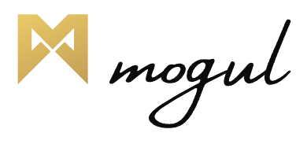

<div id="top"></div>

<!-- PROJECT SHIELDS -->
<!--
*** I'm using markdown "reference style" links for readability.
*** Reference links are enclosed in brackets [ ] instead of parentheses ( ).
*** See the bottom of this document for the declaration of the reference variables
*** for contributors-url, forks-url, etc. This is an optional, concise syntax you may use.
*** https://www.markdownguide.org/basic-syntax/#reference-style-links
-->

<!-- [![Contributors][contributors-shield]][contributors-url]
[![Forks][forks-shield]][forks-url]
[![Issues][issues-shield]][issues-url] -->

<!-- PROJECT LOGO -->
<br />
<div align="center">
  <a href="https://github.com/mogulproductions/nft-marketplace-contracts">
    
  </a>

<br />

<h3 align="center">Mogies Dutch Auction Contract</h3>

  <p align="center">
A variation on the <a href="https://github.com/chiru-labs/ERC721A/blob/main/contracts/ERC721A.sol"><strong>ERC-721A »</strong></a> Non-Fungible Token Standard

The following smart contract allows for the implementation of a "Dutch Auction" sale for NFTs. This standard provides basic functionality for selling NFTs.

<ul align="left">
  <li>Whitelist - a list of wallet address that are enabled for a guaranteed sale at a discount</li>
  <li>Public Sale - Post-auction public sale that allows remaining NFTS to be sold</li>
  <li>Token Rebate - Rebate a % of tokens spent during the dutch auction to users</li>
  <li>Developer Mint - Function to mint any remaining unclaimed NFTs </li>
  <li>Bonus Mint - Additional bonus redemption of remaining NFTs for purchasers </li>
</ul>
    <br />
    <a href="https://app.gitbook.com/o/-Mh98vFfoS7yyoIVunQH/s/-Mh991guqtMouwPer8aw/smart-contracts/mogies-dutch-auction-contract"><strong>Explore the docs »</strong></a>
    <br />
    <br />
    <!-- <a href="https://github.com/github_username/repo_name/issues">Report Bug</a>
    ·
    <a href="https://github.com/github_username/repo_name/issues">Request Feature</a> -->
  </p>
</div>

<!-- TABLE OF CONTENTS -->
<details>
  <summary>Table of Contents</summary>
  <ol>
    <li>
      <a href="#about-the-project">About The Project</a>
      <ul>
        <li><a href="#built-with">Built With</a></li>
      </ul>
    </li>
    <li>
      <a href="#getting-started">Getting Started</a>
      <ul>
        <li><a href="#prerequisites">Prerequisites</a></li>
        <li><a href="#installation">Installation</a></li>
      </ul>
    </li>
    <li><a href="#contact">Contact</a></li>
    <li><a href="#acknowledgments">Acknowledgments</a></li>
  </ol>
</details>

<!-- ABOUT THE PROJECT -->

## About The Project

Mogies is an NFT collection of 1923 NFTs inspired by the last 100 years of Hollywood characters and personalities in celebration of the 100 year anniversary of the Hollywood sign being erected. This is to pay homage to the top entertainers and creators that helped Hollywood what it is today, and create a standard for the next 100 years of filmmaking that will occur within Film3 - a movement spearheaded by Mogul and our community to empower creators to create movies and content in more fan exclusive ways using blockchain technology. Mogul is where movies meet blockchain through DeFi and NFTs - and now, the Metaverse through Mogies and Mogieland.

This repo contains the ERC-721A contract that will support the sale of the Mogies in a Dutch Auction contract.

<p align="right">(<a href="#top">back to top</a>)</p>

<!-- ### Built With

- [![Next][next.js]][next-url]
- [![React][react.js]][react-url]
- [![Vue][vue.js]][vue-url]
- [![Angular][angular.io]][angular-url]
- [![Svelte][svelte.dev]][svelte-url]
- [![Laravel][laravel.com]][laravel-url]
- [![Bootstrap][bootstrap.com]][bootstrap-url]
- [![JQuery][jquery.com]][jquery-url] -->

<!-- <p align="right">(<a href="#top">back to top</a>)</p> -->

<!-- GETTING STARTED -->

## Getting Started

This is an example of how you may give instructions on setting up your project locally.
To get a local copy up and running follow these simple example steps.

### Prerequisites

This is an example of how to list things you need to use the software and how to install them.

- yarn
- node

### Dependencies and Copiling Smart Contracts

```sh
yarn
npx hardhat compile
```

### Running Tests

```sh
yarn test
```

<!-- CONTACT -->

## Contact

Mogul - [@twitter](https://twitter.com/mogulofficial_?s=20&t=xpbtuhmfAkYMneZ6Hd4XIQ) - info@mogulproductions.com

Project Link: [https://github.com/github_username/repo_name](https://github.com/github_username/repo_name)

<p align="right">(<a href="#top">back to top</a>)</p>

<!-- ACKNOWLEDGMENTS -->

## Acknowledgments

- [chiru-labs-ERC721A](https://github.com/chiru-labs/ERC721A/blob/main/contracts/ERC721A.sol)

<p align="right">(<a href="#top">back to top</a>)</p>

<!-- MARKDOWN LINKS & IMAGES -->
<!-- https://www.markdownguide.org/basic-syntax/#reference-style-links -->

[contributors-shield]: https://img.shields.io/github/contributors/github_username/repo_name.svg?style=for-the-badge
[contributors-url]: https://github.com/github_username/repo_name/graphs/contributors
[forks-shield]: https://img.shields.io/github/forks/github_username/repo_name.svg?style=for-the-badge
[forks-url]: https://github.com/github_username/repo_name/network/members
[stars-shield]: https://img.shields.io/github/stars/github_username/repo_name.svg?style=for-the-badge
[stars-url]: https://github.com/github_username/repo_name/stargazers
[issues-shield]: https://img.shields.io/github/issues/github_username/repo_name.svg?style=for-the-badge
[issues-url]: https://github.com/github_username/repo_name/issues
[license-shield]: https://img.shields.io/github/license/github_username/repo_name.svg?style=for-the-badge
[license-url]: https://github.com/github_username/repo_name/blob/master/LICENSE.txt
[linkedin-shield]: https://img.shields.io/badge/-LinkedIn-black.svg?style=for-the-badge&logo=linkedin&colorB=555
[linkedin-url]: https://linkedin.com/in/linkedin_username
[product-screenshot]: images/screenshot.png
[next.js]: https://img.shields.io/badge/next.js-000000?style=for-the-badge&logo=nextdotjs&logoColor=white
[next-url]: https://nextjs.org/
[react.js]: https://img.shields.io/badge/React-20232A?style=for-the-badge&logo=react&logoColor=61DAFB
[react-url]: https://reactjs.org/
[vue.js]: https://img.shields.io/badge/Vue.js-35495E?style=for-the-badge&logo=vuedotjs&logoColor=4FC08D
[vue-url]: https://vuejs.org/
[angular.io]: https://img.shields.io/badge/Angular-DD0031?style=for-the-badge&logo=angular&logoColor=white
[angular-url]: https://angular.io/
[svelte.dev]: https://img.shields.io/badge/Svelte-4A4A55?style=for-the-badge&logo=svelte&logoColor=FF3E00
[svelte-url]: https://svelte.dev/
[laravel.com]: https://img.shields.io/badge/Laravel-FF2D20?style=for-the-badge&logo=laravel&logoColor=white
[laravel-url]: https://laravel.com
[bootstrap.com]: https://img.shields.io/badge/Bootstrap-563D7C?style=for-the-badge&logo=bootstrap&logoColor=white
[bootstrap-url]: https://getbootstrap.com
[jquery.com]: https://img.shields.io/badge/jQuery-0769AD?style=for-the-badge&logo=jquery&logoColor=white
[jquery-url]: https://jquery.com
